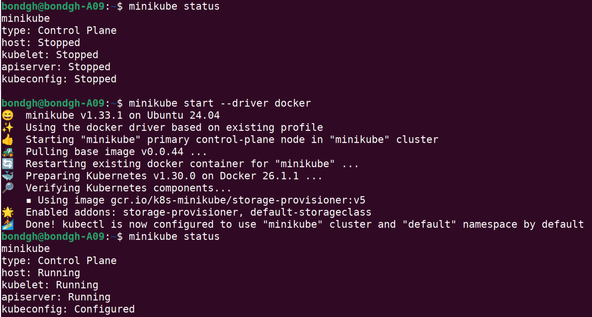
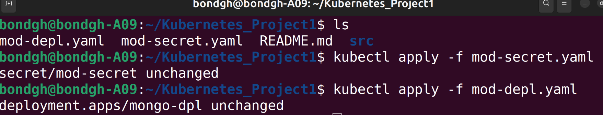

<h1>Demo Project</h1>

<h2>Project Description</h2>
Setup local K8s cluster with minkube
Deploy MongoDB and MongoExpress with configuration and credentials extrated into configMap and Sercret
 

<h2>Technologies used</h2>

- <b>Kubernetes</b> 
- <b>Docker</b>
- <b>MongoDB</b>
- <b>Mongo Express</b>

<h2>Detailed Description of Project </h2>

Install minikube and start minikube with docker as the driver:  

 
 
Create yaml configuration files to start mongodb  deployment and service: 
1. Create a mongodb pod/deployment and in order to communicate with the pod, a Service is required  
 create internal service to allow only internal components in the cluster to communicate with each other  
 create ("mod-dpl.yaml") file using the visual studio code editor  
 

     check docker hub for official configuration guide of mongodb image  
     two environmental variables that need to be set are 
     MONGO_INITDB_ROOT_USERNAME:
     MONGO_INITDB_ROOT_PASSWORD:
     NB: Because the configuration file is going to be checked into the repository, it is not a  
     good practice to add username and password in the configuration file  
     therefore:  
     create a secret key in minikube  
     create a new file "mod-secret.yaml"  
     the kind:"Secret"  
     use base64 to generate the key value pair  
     echo -u "username"|base64
     echo -u "password"|base64
create the secret and mogodb deployment using "Kubectl apply command"

Create a mongodb Service in same mongodb deployment configuration file
NB: The "target port in the service should be the same as the deployment port
 
   
     

 
 
Enter the number of passes:  

 
 
Confirm your selection:   

 
 
Wait for process to complete (may take some time):   

 
 
Sanitization complete:   

 
 
Observe the wiped disk:   

